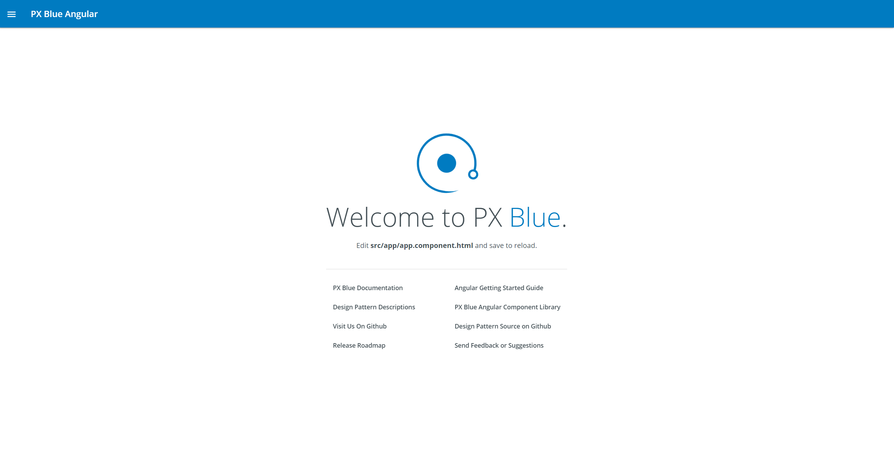
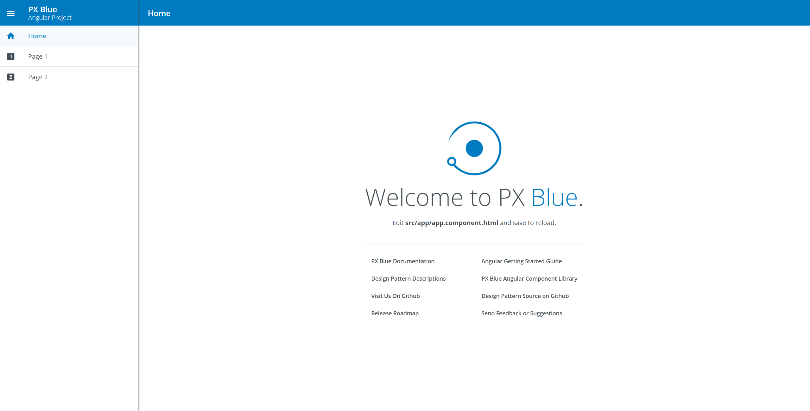
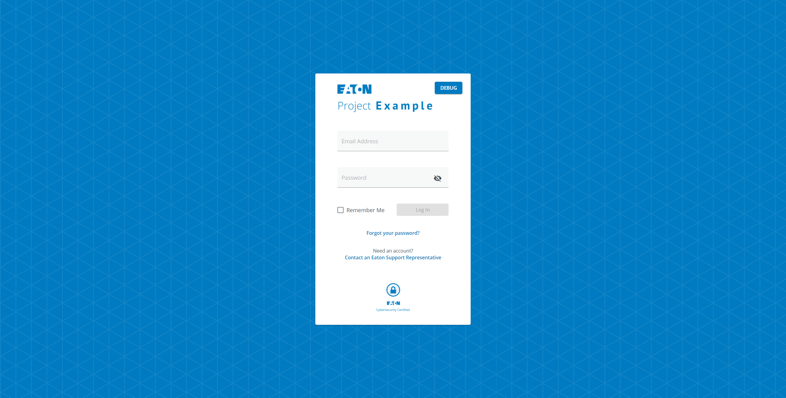

# Angular CLI Templates

These are project templates that are used by the Brightlayer UI CLI when starting a new Brightlayer UI project. 

## Available Templates

### Blank
The Blank template provides a bare-bones application with Brightlayer UI components and themes automatically configured and ready to use. This template is available through [npm](https://www.npmjs.com/package/@brightlayer-ui/angular-template-blank) and source code can be found [here](https://github.com/brightlayer-ui/angular-cli-templates/tree/dev/src/app/blank).

### Routing
The Routing template provides all of the essential Brightlayer UI configuration as well as an `app.routing.ts` configuration and a few sample pages. It also adds a navigation Drawer to switch between several sample screens. This template is through [npm](https://www.npmjs.com/package/@brightlayer-ui/angular-template-routing) and source code can be found [here](https://github.com/brightlayer-ui/angular-cli-templates/tree/dev/src/app/routing).

### Authentication
The Authentication template includes everything from the Routing template and also installs and configures the Brightlayer UI [angular-auth-workflow](https://www.npmjs.com/package/@brightlayer-ui/angular-auth-workflow) package to automatically wrap the main application with functions and screens for Login, Registration, Change Password, etc. This template is available through [npm](https://www.npmjs.com/package/@brightlayer-ui/angular-template-authentication-typescript) and the source can be found [here](https://github.com/brightlayer-ui/angular-cli-templates/tree/dev/src/app/auth-workflow).

|                | placeholder landing page | navigation drawer & routing  | login & registration screens  |
| -------------- | ------------------------ | ---------------------------- | ----------------------------- |
| Blank          | ✅                       |                              |                               |                                
| Routing        | ✅                       | ✅                           |                               |
| Authentication | ✅                       | ✅                           | ✅                            |


## Screenshots
#### Blank Template

#### Routing Template

#### Authentication Template


## Usage
You can use these templates with the Brightlayer UI CLI (recommended):

```sh
npx -p @brightlayer-ui/cli blui new angular --template=blank
npx -p @brightlayer-ui/cli blui new angular --template=routing
npx -p @brightlayer-ui/cli blui new angular --template=authentication
```

## Testing Locally
If you would like to test these templates locally, you may do so by running the following command:
```
yarn start:blank 
or
yarn start:routing
or
yarn start:auth-workflow
```

## Adding New Templates
Adding new templates to this repository requires multiple steps.

##### 1. Create a new template folder.
In the `src/app/` folder, create a new folder for your template. The easiest way to do this is to copy/paste/rename the `/blank` template folder.  Since our templates are published in npm, update the `package.json` to include correct information. 

##### 2. Add a new `environment` file.
In the `src/environments` folder, each template has a corresponding environment file.  Add a new environment file following the naming convention `environment.[template-name].ts`.  Update your name environment's `templateName` prop to be a unique identifier. 

##### 3. Update angular.json to use new environment.
In the `angular.json`, add the sample configuration below to correctly load your new environment when invoked.
```angular2
"[template-name]": {
    "fileReplacements": [
        {
            "replace": "src/environments/environment.ts",
            "with": "src/environments/environment.[template-name].ts"
        }
    ]
}
```

##### 4. Update app entry point.
Update `main.ts` to load your new template's `AppModule` when your new environment is invoked.  Your environment's `templateName` will be used here to determine which `AppModule` to load. 


##### 5. Add a new `yarn start` command.
In the root `package.json`, add a new `yarn start:[template-name]` command to invoke your environment.  

This command should follow this format: 
```
"scripts": {
    ...
    "start:[template-name]": "ng serve -c [template-name]"
    ...
}
```

Once this is added, your new template is ready for development. 

## Browser Support

Brightlayer UI CLI Templates will work with any modern browser. For details refer to our [Browser Support](https://brightlayer-ui.github.io/development/frameworks-web/angular#browser-support) documentation.
